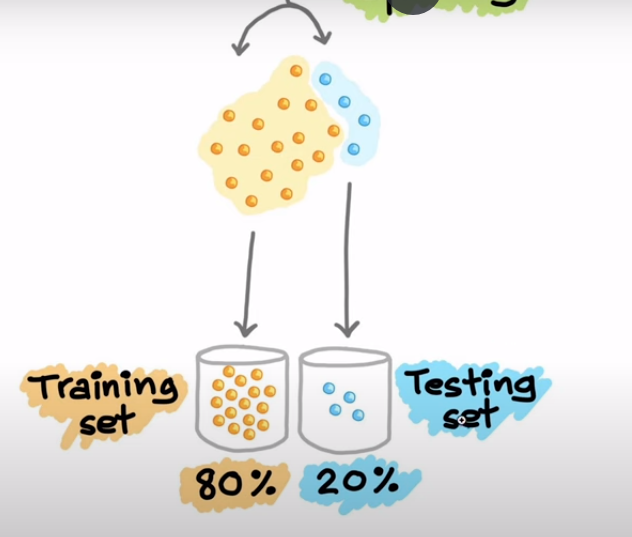
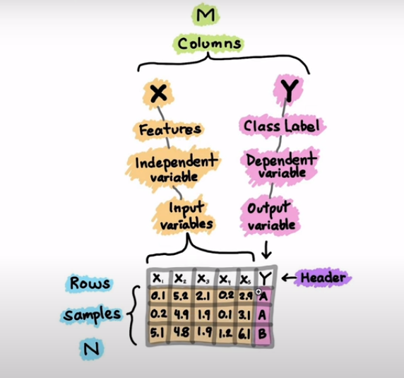

# Notes of what i've learned and where i've learned it from:

2023-12-25 1:11 PM:
## Data professor:
## [How to build a machine learning Model](https://www.youtube.com/watch?v=NRnaMCNOK7Y&t=19s)

- ## [Article](https://towardsdatascience.com/how-to-build-a-machine-learning-model-439ab8fb3fb1)

### Why split data ?

